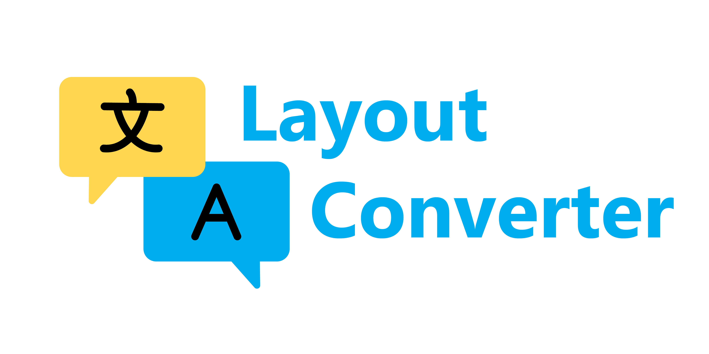

# LAYOUT CONVERTER



Convert abrakadabra into noraml text. E.g. "руддщ цщкдв" into "hello world". It is a tray app without gui.
Any questions? Write me: [@Cartoonboy](https://t.me/Cartoonboy)

## Usage

### Convert layout

* Highlight text
* Press shortcut(Ctrl + Shift + Shift)

### Convert capitalization

* Highlight text
* Turn on Caps Lock
* Press shortcut (Ctrl + Shift + Shift)

### Translate

* Change your keyboard layout to desired lang
* Highlight text
* Press shortcut (Ctrl + Alt + Alt)

### Change language

* Press shortcut (Ctrl + Alt + number)
* You can change languages and their order in your language settings

## Ubuntu dependencies

* `sudo apt-get install xclip`

## Fixes

```python
ImportError: No module named gi
```

* Copy `gi` module manualy from global site-packages into your `.venv`
* Or create venv with `virtualenv --system-site-packages .venv`
